# CSCE 435 Group 16 project

## 0. Group number: 16

## 1. Group members:

1. Anjali Kumar
2. Shawn Mathen
3. Ashrita Vadlapatla
4. Robert Eads

## 2. Project topic (e.g., parallel sorting algorithms)

Parallel Sorting Algorithms

## 2a. Communication Method

Our team's primary method of communication will be GroupMe with Slack as a secondary method.

## 2b. Brief project description (what algorithms will you be comparing and on what architectures)

Each of the selected sort algorithms, Bubble, Merge, Selection, & Sample will be run in parallel using MPI and CUDA separately.

## 2c. Pseudocode for each parallel algorithm

### Algorithm 1: Bubble Sort

#### MPI

```
1. Distribute the data among processes using MPI_Scatter.
2. Each process performs a local sequential Bubble Sort on its portion of the data.
3. Exchange data with neighboring processes using MPI_Send and MPI_Recv for each iteration of the Bubble Sort.
4. Perform multiple iterations of the Bubble Sort while exchanging and comparing adjacent elements to sort the entire dataset.
5. Repeat the Bubble Sort and data exchange steps for the required number of iterations (in parallel) to ensure a fully sorted dataset.
6. Verify the correctness of the sorted data.
```

#### CUDA

```
1. Each CUDA thread loads a portion of the data into shared memory.
2. Perform a local sequential Bubble Sort within each thread's shared memory.
3. Synchronize threads to ensure all shared memory sorting is complete.
4. No need for pivot or reduction steps, as Bubble Sort doesn't require pivot-based partitioning.
5. Each thread can individually compare and swap adjacent elements in its partition as part of the Bubble Sort.
6. No offset calculations are needed in Bubble Sort.
7. There is no need for a scatter operation, as Bubble Sort is an in-place sorting algorithm.
8. Continue the Bubble Sort for the required number of iterations, ensuring all elements are correctly sorted.
9. There's no merging step in Bubble Sort, as it's an exchange-based sorting algorithm that works directly on the data in place.
```

#### General Pseudocode

```
begin BubbleSort(list)

   for all elements of list
      if list[i] > list[i+1]
         swap(list[i], list[i+1])
      end if
   end for

   return list

end BubbleSort
```

#### MPI Pseudocode

```
void parallelBubbleSort(vector<int> &localData) {
    int myRank, numProcesses;
    MPI_Comm_rank(MPI_COMM_WORLD, &myRank);
    MPI_Comm_size(MPI_COMM_WORLD, &numProcesses);

    int localN = localData.size();

    for (int i = 0; i < localN - 1; i++) {
        for (int j = 0; j < localN - i - 1; j++) {
            if (localData[j] > localData[j + 1]) {
                swap(localData[j], localData[j + 1]);
            }
        }
    }
}
```

#### CUDA Pseudocode

```
__global__ void bubbleSort(int *array, int size) {
    int tid = threadIdx.x + blockIdx.x * blockDim.x;

    if (tid < size) {
        for (int i = 0; i < size - 1; i++) {
            for (int j = 0; j < size - i - 1; j++) {
                if (array[j] > array[j + 1]) {
                    int temp = array[j];
                    array[j] = array[j + 1];
                    array[j + 1] = temp;
                }
            }
        }
    }
}
```

### Algorithm 2: Merge Sort

#### MPI

```
1. Distribute data among processes
2. Each process performs a local sequential merge sort
3. Pairwise merging of sorted sublists using MPI_Send and MPI_Recv
4. Recursively perform merging until the data is fully sorted
5. Verify correctness
```

#### CUDA

```
1. Each CUDA thread loads a portion of the data into shared memory
2. Perform a local sequential merge sort within each thread's shared memory
3. Use CUDA parallel reduction to find the pivot elements
4. Broadcast to all threads
5. Each thread partitions its data around pivot
6. Calculate the offsets for each partition
7. CUDA scatter to move elements to their respective partitions
8. Recursively sort each partition using CUDA parallel sort
9. Perform parallel merge or merge in shared memory, depending on the size of the partitions
```

#### Pseudocode

Parallel:
The following parallel Merge Sort algorithms will be implemented using MPI.

```python
function parallel_merge_sort(arr, num_threads)
    if length(arr) <= 1
        return arr

    mid = length(arr) // 2
    left = arr[0...mid-1]
    right = arr[mid...]

    if num_threads > 1
        left_thread = start_thread(parallel_merge_sort(left, num_threads/2))
        right_thread = start_thread(parallel_merge_sort(right, num_threads/2))
        join_thread(left_thread)
        join_thread(right_thread)

    else
        left = merge_sort(left)
        right = merge_sort(right)

    return parallel_merge(left, right)
```

The following is pseudocode for a CUDA implementation

```c++
__global__ void mergeCUDA(int* arr, int left, int mid, int right) {
    // Sequential merge
}

__global__ void mergeSortParallelCUDA(int* arr, int size) {
    if (size <= 1) return;

    int mid = size / 2;

    int* left = arr;
    int* right = arr + mid;

    mergeSortParallelCUDA<<<1, 1>>>(left, mid);
    mergeSortParallelCUDA<<<1, 1>>>(right, size - mid);

    mergeCUDA(arr, 0, mid - 1, size - 1);
}

```

### Algorithm 3: Selection Sort

#### MPI

```
1. Distribute the data among processes using MPI_Scatter.
2. Each process applies the selection sort algorithm to its portion of the data.
3. The sort selects the minimum element and swaps it with the first unsorted element so that there is a local sorted segment.
3. Communicate with neighboring processes using MPI_Send and MPI_Recv to exchange boundary data so that elements are placed correctly.
4. There is no need for a scatter operation, as Selection Sort is an in-place sorting algorithm.
5. Repeat the Selection Sort for the required number of iterations, ensuring all elements are correctly sorted.
6. Verify the correctness of the sorted data.
```

#### CUDA

```
1. Each CUDA thread loads a portion of the data into shared memory
2. Implement selection sort within the shared memory to locally sort the data.
3. Utilize CUDA parallel reduction techniques to find the minimum element within the shared memory.
4. Share the minimum element among all threads.
5. Partition the data based on the broadcasted minimum element.
6. Determine offsets for each partition to facilitate data movement.
7. Utilize CUDA scatter operations to move elements to their respective partitions.
8. Continue the selection sort for a certain number of iterations.
9. As selection sort is an exchange-based sorting algorithm that works directly on the data in place, there is no merging.
```

```

void selectionSort(int arr[], int n)
{
    int i, j, min_idx;

    // One by one move boundary of
    // unsorted subarray
    for (i = 0; i < n - 1; i++) {

        // Find the minimum element in
        // unsorted array
        min_idx = i;
        for (j = i + 1; j < n; j++) {
            if (arr[j] < arr[min_idx])
                min_idx = j;
        }

        // Swap the found minimum element
        // with the first element
        if (min_idx != i)
            swap(arr[min_idx], arr[i]);
    }
}

```

### Algorithm 4: Sample Sort

#### MPI

```
FOR number of splitters selected by each process
      Push back randomly selected value from local data to sample vector
Allocate memory for all sampled splitters
MPI_Allgather sampled splitters to each process
Sort sampled splitters and choose bucket bounds from thoughout sampled splitters
Evaluate local elements and place into send buffers
Calculate required buffer size from each process
FOR number of processes
      MPI_Gather the buffer sizes from each process on each process
Allocate receive buffer for incoming data
FOR number of processes
      MPI_Gatherv to send data to the correct process
Sort with sequential quicksort
```

#### CUDA

```
*All steps are performed with CUDA kernals with the expection of data transfer*
Sample and select splitters to use
Sort samples
Gather required info about each bucket
Group elements into buckets within an array
Sort the data within each bucket
Transfer data from GPU to CPU
```

## 2d. Citations

- https://www.tutorialspoint.com/data_structures_algorithms/bubble_sort_algorithm.htm
- https://compucademy.net/algorithmic-thinking-with-python-part-3-divide-and-conquer-strategy/#:~:text=There%20is%20a%20really%20clever%20trick%20that,the%20same%20type%20as%20the%20original%20problem.
- https://teivah.medium.com/parallel-merge-sort-in-java-e3213ae9fa2c
- https://www.geeksforgeeks.org/quick-sort/
- https://cse.buffalo.edu/faculty/miller/Courses/CSE702/Nicolas-Barrios-Fall-2021.pdf
- https://en.wikipedia.org/wiki/Samplesort
- https://www.geeksforgeeks.org/selection-sort/
- https://pushkar2196.wordpress.com/2017/04/19/mergesort-cuda-implementation/

## 2e. Evaluation plan - what and how will you measure and compare

Each algorithm with be run with the input types of sorted, reverse sorted, and randomized. The input sizes are planned to be 2^16, 2^20, and 2^24.
Both weak and strong scaling will be analyzed and compared against the other algorithms being tested.
The number of threads in a block on the GPU will be [64, 128, 512, 1024].

## 3. Project Implementation

The listed algorithms were fully implemented using both MPI and CUDA.

## 4. Performance Evaluation

### Sample Sort

#### MPI

##### Randomized

<!-- Strong -->

For randomized inputs, this sample sort implementation clearly displays a lack of strong scaling on all three input sizes tested, 2^16, 2^18, & 2^20. While there is a minor decrease in runtime for 64 processes, the rest of the graph does not share this trend. The pattern presented below can most likely be attributed to the computation portion of its runtime due to the increase in overhead and therefore required time when adding more processes.


<!-- Weak -->

Weak scaling for this sample sort implementation presents an interesting graph shape for randomized input data. While the main and comm sections have decent weak scaling performace between 16 and 64 processes and then have poor weak scaling after that, the computation portion of the algorithm has no indication of anything but poor weak scaling performance. This is likely to hamper the algorithms performance when working with larger inputs.


##### Sorted

<!-- Strong -->

For sorted inputs, while not quite true strong scaling, the sample sort implementation does a much better job with lower numbers of processes. The computation time stays roughly same from 2 processes up to 32 processes before fluxuating and eventually rising. The communication time shows a similar pattern to that of randomized inputs, and the graph for overall time moves closer to the computation graph for the beginning portion. This flat lining of computation time near the beginning could be due to the few number of buckets and underlying quick sort algorithm enabling it to only need a small number of runs to verifiy the data is sorted.


<!-- Weak -->

Weak scaling performance for a sorted input is very similar to that of the randomized input. Interesting to note however, the larger impact of the comp section can be seen as the main graph has less of a flatline between 16 and 64 processes.


##### Reverse Sorted

<!-- Strong -->

A very similar story is told by the reverse sorted graphs as by the sorted graph. Computation flatlines until about 32 processes and then increases wildly, communication displays poor strong scaling performance, and the overall graphs is good mix of the two. As this is the third comm graph to display a sharp decrease in runtime at the 64 process mark, it is likely this benifit is due to the CPUs on Grace being 24 cores each, 48 hardware threads, which means at 64 processes the second CPU is being used and the additional cache memory is now introduced into the equation during communication.


<!-- Weak -->

The weak scaling for reverse sorted inputs looks very similar to the other two input types. Comm has moderate weak scaling in the beginning, but comp's poor weak scaling performance over shadows any positives when it comes to overall runtime.


#### CUDA

##### Randomized

<!-- Strong -->

The CUDA implementation of sample sort does seem to display decent strong scaling performance for the larger input sizes. This is mainly due to the computation time as the comm graph is mostly flat and seems to have little overall impact if any. The sharp drop seen at 1024 threads for 2^16 input size seems to be an outlier as that data point does not make sense given the rest of the graph.


<!-- Weak -->

There is not much to be said about the weak scaling performance of this sample sort implementation. It has very poor performance overall due to the similarly poor graphs in both the comm and comp regions.


##### Sorted

<!-- Strong -->

When looking at strong scaling performance with sorted input, no clear picture emerges one way or the other. When compared to randomized input, sorted input seems to have worse overall strong scaling performance, but it's can be hard to tell due to the inconsistent shape of the graph. The comm regions are roughly the same between the two inputs, but computation for sorted is much less strongly scaled than randomized, leading to the main graph looking a bit wild.


<!-- Weak -->

While the strong scaling got worse with sorted input, the weak scaling seems to be a little bit better. While comm did not change much, the comp regions' scaling improved and so the main graphs looks a little bit better between 64 an 256 threads.


##### Reverse Sorted

<!-- Strong -->

Reverse sorted inputs for this sample sort implementation seems have decent strong scaling performance and get better as the size of the input increases. While the communication portion is still relatively flat, computation has fairly good strong scaling performance and that translates to the main graph as well. The trend being seen with this input type is most likely due to the underlying sorting algorithm being insertion sort. Because reverse sorted input is typically the worst case for insertion sort, being able to break it into smaller chunks likely helps to combact that usual disadvtanges that come with the algorithm.


<!-- Weak -->

Weaking scaling for reverse sorted inputs appears to fall somewhere in between randomized and sorted. Comm is pretty much the same as before and comp is only slightly better than with randomized input, so the main graphs has fairly poor weak scaling performance overall.


# Merge Sort

## Weak Scaling

### MPI

One thing to note when I did my weak scaling is that I chose to measure the average time per rank over number of processors. The reason I chose average time over total time is that disussing with the TA about how these sorts work, total time is always going to grow as you increase processors because its an aggregate of all times over all processors. Additionally, I wanted to begin by focusing on the main function times for everything because I thought a good introduction to the analysis is how the program as a whole ran on average.


#### RANDOM INPUT ARRAY
The analysis begins with weak scaling, specifically with MPI. For weak scaling, I began with the input type of a random array, where each element is a randomly generated number from 0 to n, where n is the size of the array. The most obvious trend between all of the graphs in this section is that the as you increase the number of elements, the algorithm performs more slowly. This is shown best with the largest input size of 2^28 having the largest graph, as signified by the pink line. It is interesting to note that the computation time for all the times looks relatively the same as we parallelize, and that most of the variation in times comes from the communication. I meausred both the MPI_Scatter and MPI_Gather functions, and the MPI_Gather function takes much longer than the scatter.


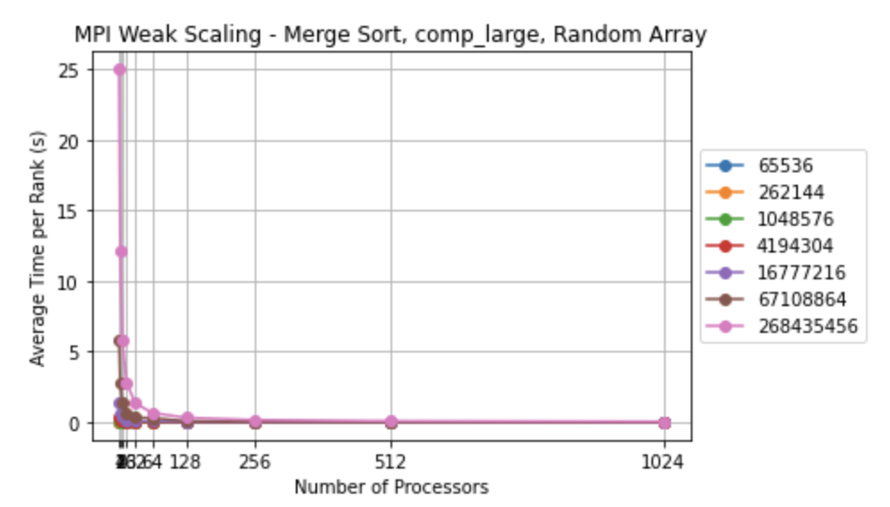
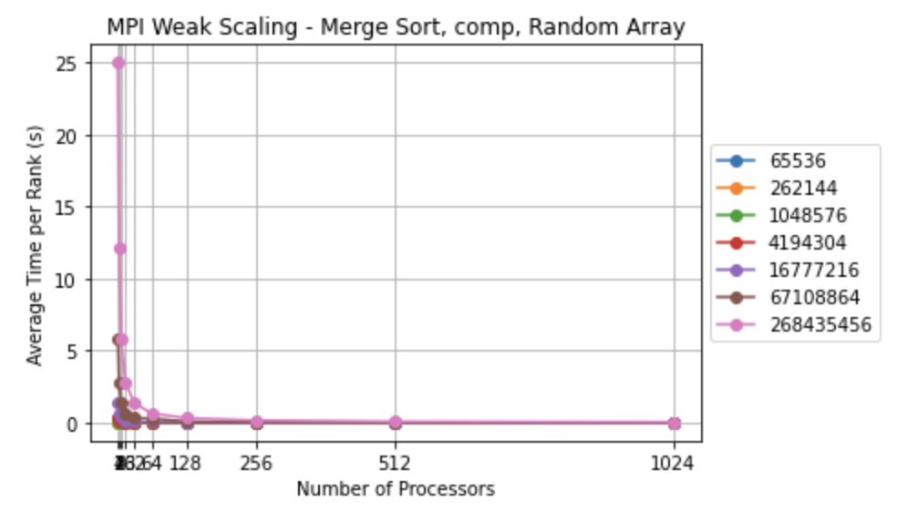


#### SORTED INPUT ARRAY

In the sorted array input type, we see very similar behavior, where larger input sizes seemed to have a much longer time to complete.


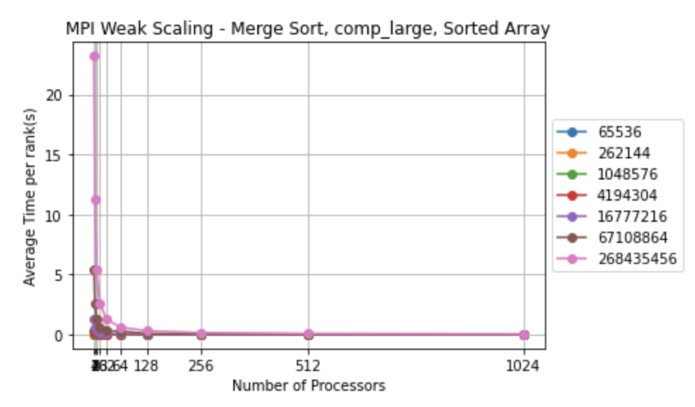

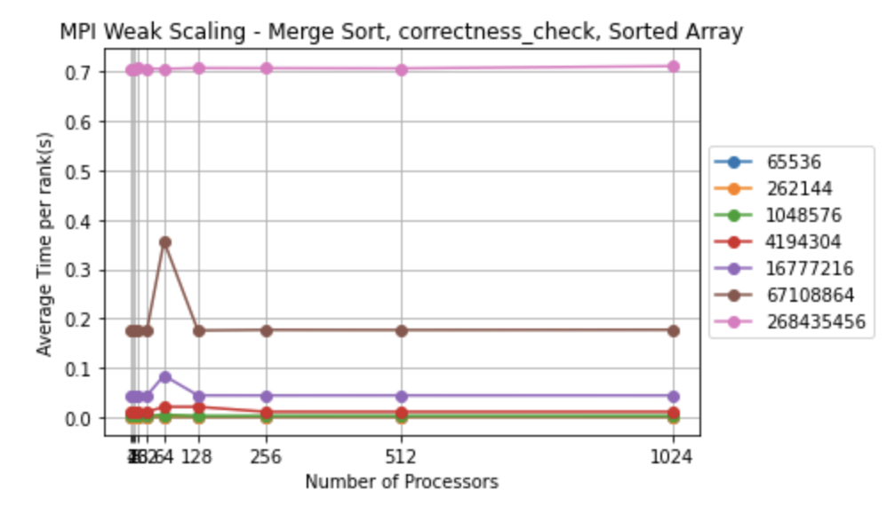


#### REVERSE SORTED INPUT ARRAY

The same behavior is present in the reverse sorted array as well.


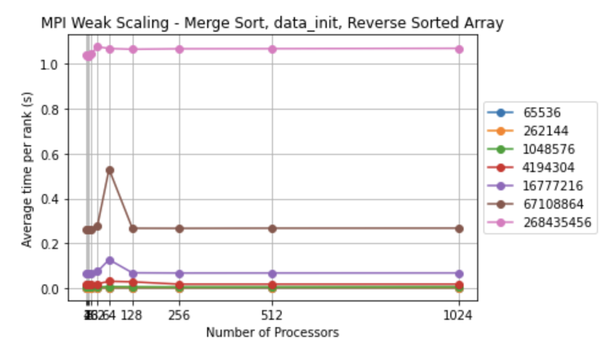


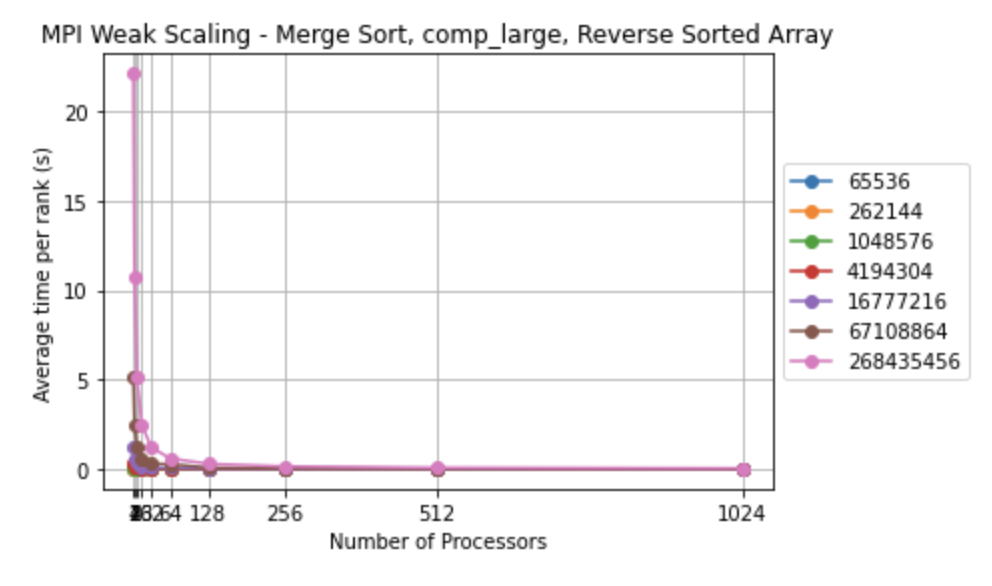


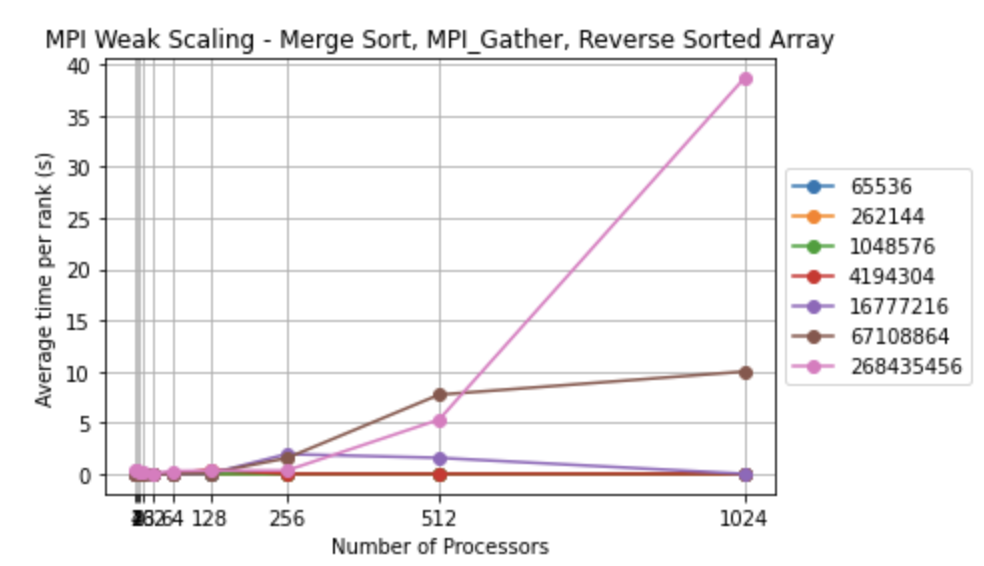

#### 1% PERTURBED INPUT ARRAY

 Finally, in the data initialized with 1% of the data perturbed, we see the similar data. We can assume this dude to merge sort typically always breaking the arrays down into a single element subarray and merging them back together, so we should expect relatively consistent behavior.

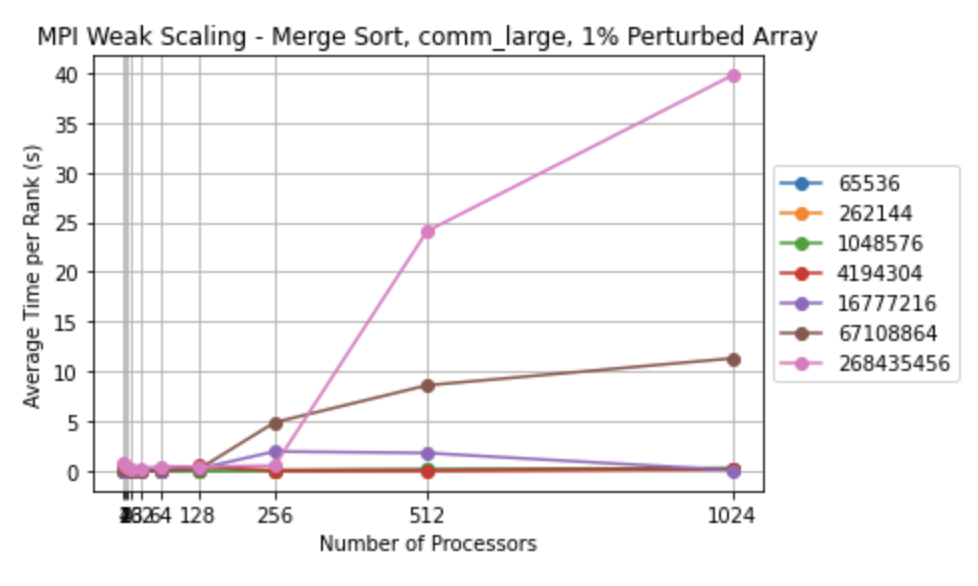
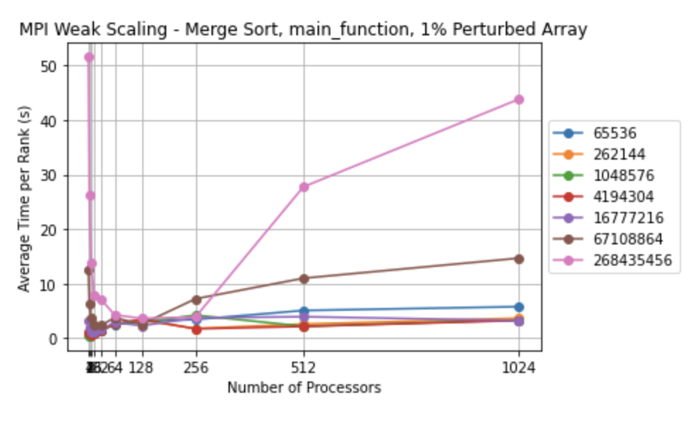

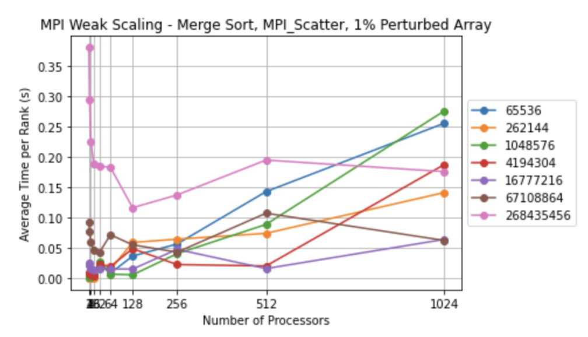
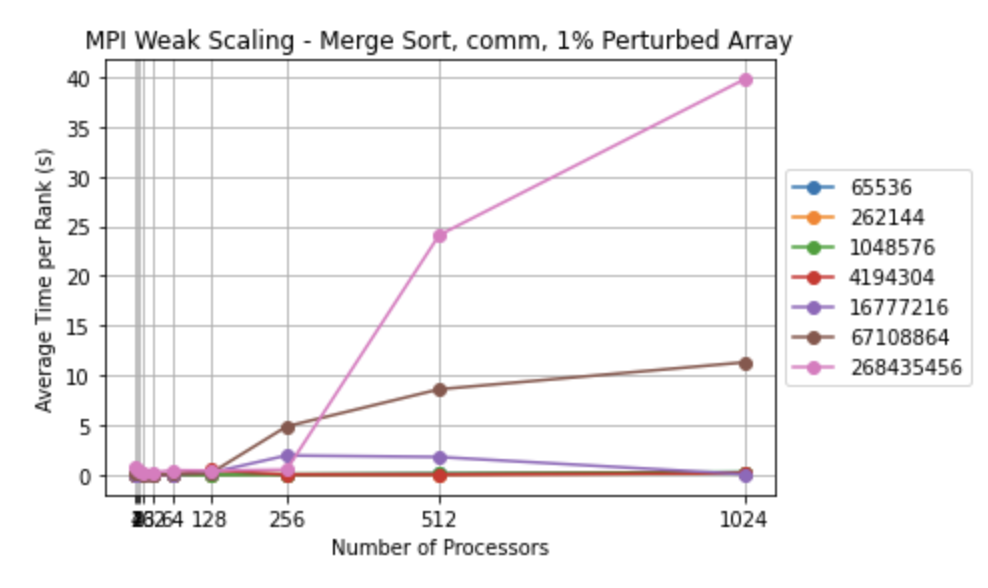


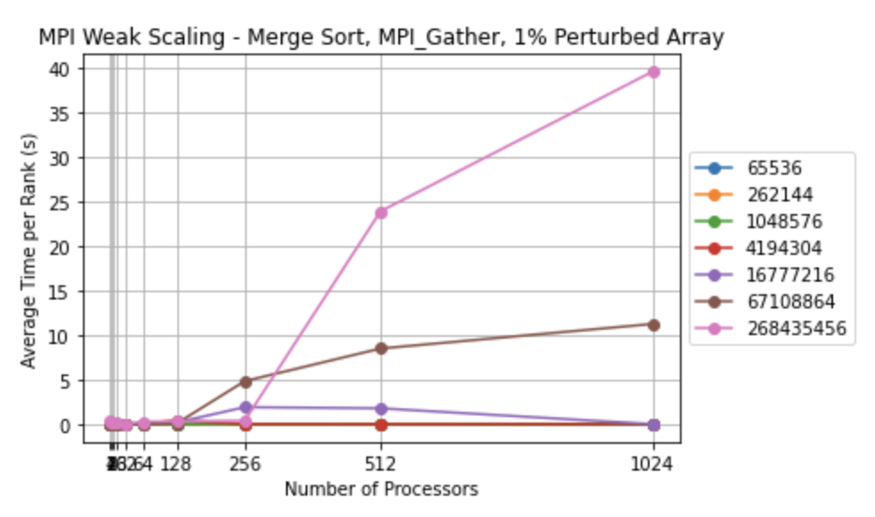

### CUDA

For the CUDA weak scaling of the different input types, we had a lot of the same activity as the MPI implementation. As we increased the number of elements in the input array, there was more time needed for the merge sort algorithm to complete. It also seems thats the CUDA implementation takes a bit longer to complete than the MPI implementation. We can see this most notably with the 2^28th line (the pink), where it takes over 120 seconds to complete the main_function, whereas the MPI implementation had a maximum of 40 seconds to complete. We also sea a lot steadier increase in time for the CUDA implementation. It is interesting to see that all of the different performance regions increase quite steadily. Another big difference with CUDA is how it handles communication. Rather than speaking to multiple processors like in MPI, CUDA handles only cudamemcpy, so we see rather constant communciation times between all of the different input sizes.

#### Random Array


#### Sorted Array


#### Reverse Sorted Array
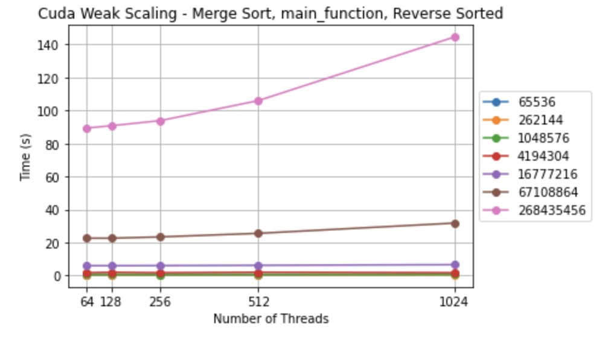


### 1% Perturbed Array
 


### Bubble Sort

#### Weak Scaling

##### MPI

Like Shawn for merge sort, I also opted to assess the average time per rank in relation to the number of processors instead of total time since total time invariably increases with the addition of processors, as it represents an aggregate of all times across all processors.

For this analysis, I examined weak scaling using 2^16 elements across all four input types (sorted, reverse sorted, randomized, and 1% perturbed). It is evident that as the number of processors increases, the sorted array consistently exhibits the fastest runtime. This scenario represents the optimal condition for bubble sort, as it involves zero swaps for elements. The efficiency of this input type remains largely unaffected by the increase in processors, given its inherently efficient nature. The next fastest is the 1% perturbed input, which demonstrates a noticeable increase in runtime as the number of processors grows. The subsequent rankings alternate between reverse sorted and randomized inputs, as expected, considering they require a greater number of swaps. Reverse sorted input is relatively insensitive to the number of processors, as it consistently involves the maximum number of swaps.


##### CUDA

For this analysis, I examined weak scaling using 2^16 elements across three input types (sorted, reverse sorted, and randomized). The results are unexpected, as all average times increase with the number of threads used. One would anticipate a decrease for some time, given that parallelization should enhance efficiency. Furthermore, similar to MPI, we observe that "Sorted" consistently ranks as the fastest, as expected, since no swaps are required. "Reverse sorted" and "randomized" exhibit variations in their next fastest rankings, which aligns with expectations as they entail more swaps. The graph suggests that for this input size (65536), parallelization is not beneficial. With additional graphs featuring different input sizes, we can discern the general trend.


### Bubble Sort

#### Weak Scaling

##### MPI
For the analysis, weak scaling was examined across the sorted input type. 2, 4, and 8 processors were run and it showed that there was an increase in average time. However, this was interesting as usually as the number of processors increases, the time should decrease due to parallelization and efficiency. However, since smaller numbers were run it might not be as easy to tell. Therefore, as more trials with more data is run, then the graph will show parallelization. The rest of the input types with the number of processors and threads will be run as the next time in order to gather more accurate data creating the various graphs. 


##### CUDA
For the analysis, for CUDA only two cali files with 16 were run so only two points are showing. It does seem that one of the points has a higher average time. Due to the small number of trials, not much can be observed from the graph. The jobs were queued on grace portal so the data was not fully able to be collected for this implementation. However, as the number of processors increases, the average time should decrease as the the paralleization of the tasks has been implemented. Therefore, the rest of the input types will be run 

